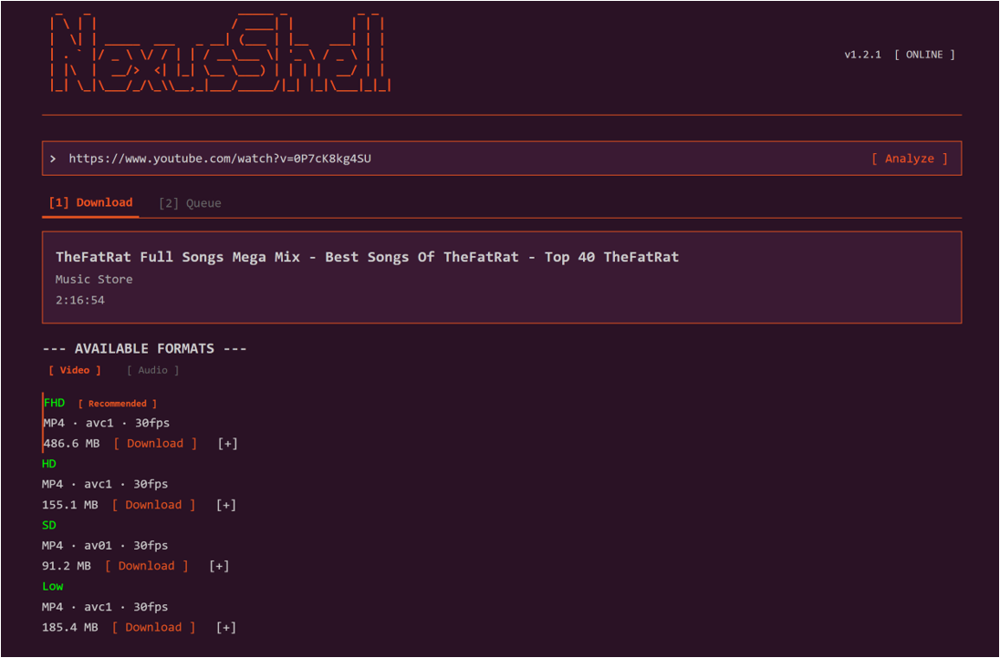
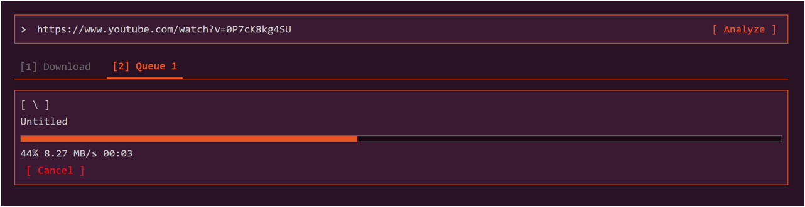

# NexusShell

> **Terminal-styled YouTube & SoundCloud downloader. Paste a link, get the file on your device.**

**▶ Live service: [https://nexusshell.kr](https://nexusshell.kr)**

NexusShell replaces the ads and clutter of typical web downloaders with a clean, keyboard-friendly terminal interface. Paste a YouTube or SoundCloud link, pick a format, and the file goes straight to your device.

> This repository is a landing page. The application's source code is **proprietary and not published here**. See [License](#license).

---

## What it does

- **YouTube + SoundCloud**: both platforms, nothing else.
- **Video or audio**: save a YouTube video as MP4 or pull just its audio. SoundCloud tracks download as audio.
- **Every quality, one obvious default**: all resolutions from 360p to 4K, each with codec and file-size variants. 1080p is marked **Recommended** and listed first; take it in one click, or pick 4K if that's what you came for.
- **Playlists as a single ZIP**: a whole playlist or set arrives as one archive named after it, tracks numbered in order. No clicking through a list of links.
- **Live progress**: real-time download progress over WebSocket.
- **Delivered to your device**: the server fetches the media, streams it to your browser, then auto-deletes its own copy. Nothing lingers on the host.
- **Private by design**: your queue and history are visible only to your own browser session. Visitor counts are stored as one-way hashes, never raw IP addresses.
- **Works on phone and tablet**: the layout adapts to small screens with real touch targets.
- **Full speed**: no queues, countdowns, or "free tier" limits.
- **Kept working**: platforms keep changing how they serve media. NexusShell switches to a working route automatically instead of breaking for days.
- **No ads, no accounts, no telemetry.**

## How it works

1. Paste a YouTube or SoundCloud URL.
2. NexusShell lists the available formats, or detects a playlist.
3. Take the **Recommended** quality, or open any tier for its variants.
4. Your browser saves the file automatically. Playlists arrive as one ZIP.

## Screenshots

**Download**: every available quality, recommended pick first.

**Queue**: live progress with speed and time remaining.

## Built with

`Python` · `Flask` · `Socket.IO` · `yt-dlp` · `FFmpeg` · `Docker` · `Caddy`

A dependency-free vanilla-JS frontend over a Flask backend, containerized behind an auto-HTTPS reverse proxy.

## Use responsibly

NexusShell is for personal, fair-use downloads. Reproducing or distributing copyrighted material commercially may carry legal consequences. Respect the source platforms' terms and the rights of creators.

## License

**Proprietary. All Rights Reserved.** Copyright © 2026 JTech-CO. See [LICENSE](LICENSE).

The Software may not be copied, reproduced, modified, redistributed, mirrored, hosted, or used to create derivative works, in whole or in part, without prior written permission. This landing page grants no right to the application's source code, which is not distributed.

---

Made by [JTech-CO](https://jtech-co.github.io/) · Live at [nexusshell.kr](https://nexusshell.kr)
